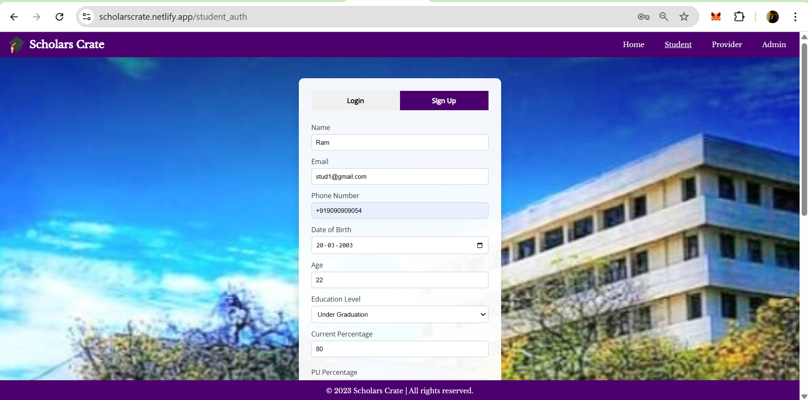
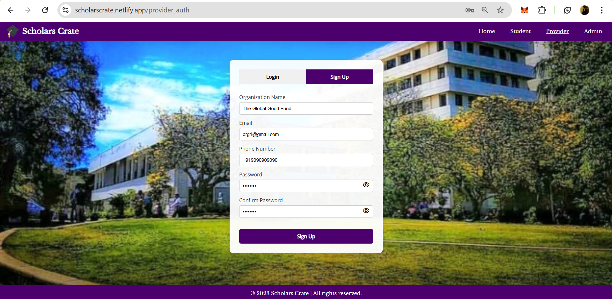
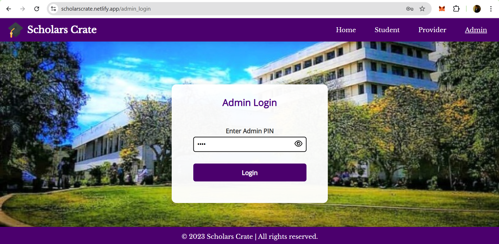
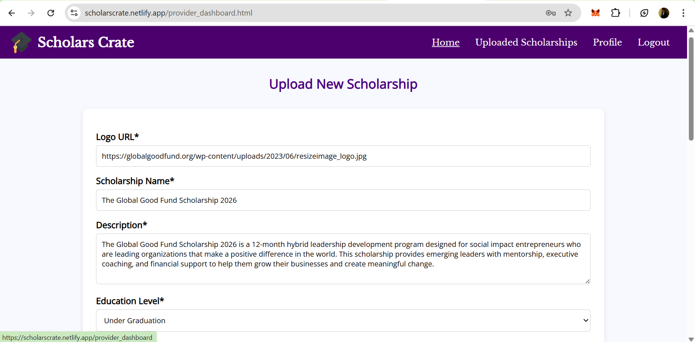

# 🎓 Scholars Crate

**Scholars Crate** is a full-stack web platform designed to simplify the process of finding and applying for scholarships. Students can sign up, input their details, and instantly view scholarships they are eligible for. Scholarship providers can post new opportunities, which get verified by an admin before going live.

---

## 🌐 Live Site

- **Frontend**: [https://scholarscrate.netlify.app](https://scholarscrate.netlify.app)
- **Backend**: [https://scholarscrate.onrender.com](https://scholarscrate.onrender.com)


---

## ✅ Features

- 🔐 **Student & Provider Authentication** (Login & Signup)
- 🎓 **Student Dashboard**:
  - View all or only eligible scholarships
  - Search by name, filter and sort results
- 📝 **Eligibility Filter**:
  - Based on education level, age, gender, caste, religion, income, and location
- 🧑‍🏫 **Provider Dashboard**:
  - Post new scholarships (pending admin approval)
- 👨‍💼 **Admin Panel**:
  - Approve provider requests
  - Add or manage scholarships
- 🗑️ **Auto-deletion of expired scholarships**
- 📱 **Responsive Design** for desktop and mobile
- 🧭 Smooth UI Navigation with Modal Popups and Pagination

---

## 🛠️ Technologies Used

### Frontend:
- HTML5, CSS3
- JavaScript (Vanilla JS)
- Font Awesome (Icons)
- Google Fonts

### Backend:
- Node.js
- Express.js
- MongoDB Atlas
- Mongoose ODM
- JWT for secure authentication
- Dotenv for environment variables

### Deployment:
- **Frontend**: Netlify
- **Backend**: Render
- **Database**: MongoDB Atlas

---

## 🖼️ Screenshots

### 🔐 Student Signup Page


### 🔐 Provider Signup Page


### 🔐 Admin Login Page


### 🎓 Student Dashboard with Filters


### 🧑‍🏫 Provider Dashboard



### 👨‍💼 Admin Panel


---

## 🚀 Getting Started (Local Development)

### Clone the Repository

```bash
git clone https://github.com/ShreeshaHShetty/ScholarsCrate.git
cd ScholarsCrate
```

---

### 🔧 Backend Setup

```bash
cd backend
npm install
```

Create a `.env` file inside the `backend/` folder with the following contents:

```env
PORT=5000
MONGO_URI=your_mongodb_connection_string
JWT_SECRET=your_strong_jwt_secret
```

Run the backend:

```bash
npm start
```

---

### 💻 Frontend Setup

```bash
cd ../frontend
```

You can open `index.html` directly in a browser for local testing.


---

## 📂 Project Structure

```
ScholarsCrate/
│
├── backend/         → Node.js + Express + MongoDB backend
│   ├── models/
│   ├── routes/
│   ├── config/
│   ├── .env
│   └── server.js
│
├── frontend/        → HTML, CSS, JS frontend
│   └── index.html
│
├── screenshots/     → UI screenshots for README
└── README.md
```

## 🙏 Acknowledgments

This project was built with dedication and passion for helping students easily access scholarship opportunities.

Created by **Shreesha H Shetty**  
💡 Powered by Node.js, MongoDB, and Netlify.